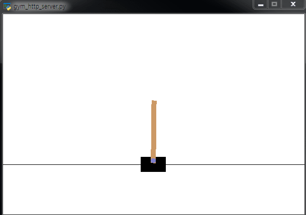
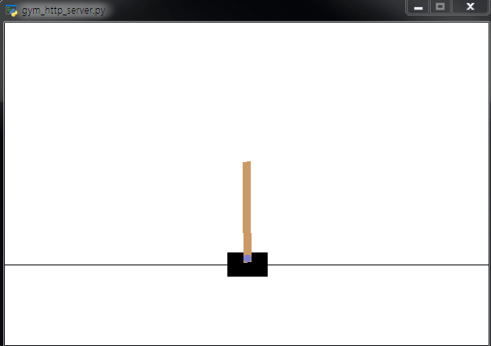
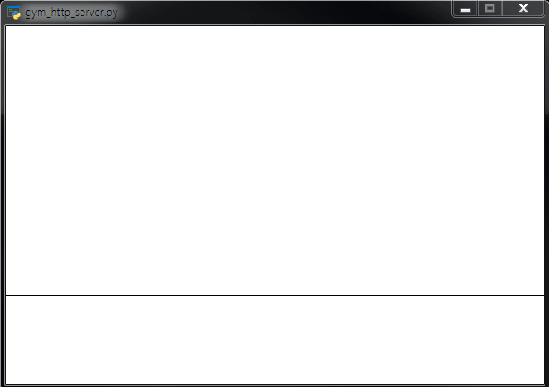

# gymR
CartPole_v0 example: [https://gym.openai.com/docs/]
1. Finite-difference stochastic approximation algorithm (FDSA)

----------------------
2. Simultaneous pertubation stochastic approximation algorithm (SPSA)

----------------------
3. Adaptive SPSA (2SPSA)

